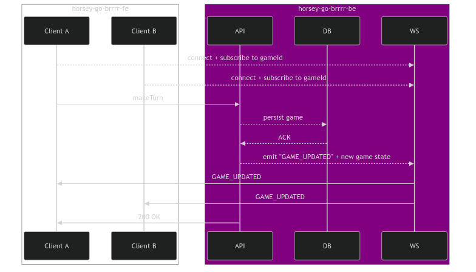
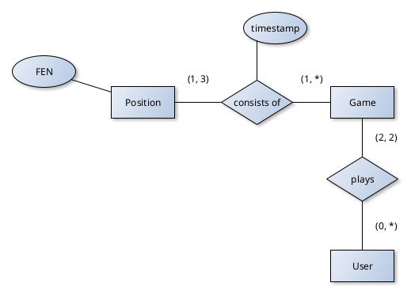

## In loving Memory

🪦 10.04.2025 Josia

# horsey-go-brrrr-be

Backend for 4th-semester DHBW Web technologies project 'horsey-go-brrrr'. <br>
Initially, this was planned to be a multiplayer chess app. Due to the unfortunate reality of the development team being halved, it has been scaled down to a 4-in-a-row game.
Nevertheless, the name shall remain as a glorious tribute to those whomst have fallen, for they shall never be forgotten.

### Tech Stack
- Quarkus
- Java 21
- Build Tool: Maven

## Local setup

First, start the postgresql docker container by running the provided docker compose file.

```bash
docker compose up -d
```

- Requirements:
  - Java 21
  - Maven 3.8

```bash
./mvnw quarkus:dev
```

## Docker Build
```bash
./mvnw clean package  -DskipTests
docker build -f src/main/docker/Dockerfile.jvm -t heofthetea/horsey-go-brrrr-be:jvm-latest .
```

A readily built image is available on docker hub under [heofthetea/horsey-go-brrrr-be:jvm-latest](hub.docker.com/repository/docker/heofthetea/horsey-go-brrrr-be).<br>
A full deployment of the app, including the frontend Vue app, can be found in the github repository [horsey-go-brrrr-deployment](https://github.com/heofthetea/horsey-go-brrrr-deployment).

## Resources

### JEN documentation

[jen.md](doc/jen.md)

### Turn Workflow with Websocket


### Swagger UI

The project ships with a swagger UI. This is accessible under
[http://http://localhost:8080/api/q/swagger-ui/#/](http://http://localhost:8080/api/q/swagger-ui/#/) when running the project in dev mode.

### erm
> [!warning] This is the initial ERM back from when this thing was still supposed to be chess. The fundamental relationships remain tho.
 



## Repository tour
All source Code is located in `src/main`.<br>
There are some unit tests for operations on JEN strings under `src/test/java`<br>
The configuration happens in `application.yml`, located in `src/main/resources`.

### Main java code
The following is the file tree of the main java source code. <br>
The project follows a controller-service-ORM structure. Controllers configure REST endpoints, while Service classes
handle business logic and communication to the database through Hibernate and JPA ORMs.
```
src/main/java/brrrr/go/horsey/
├── controllers
│   ├── GameResource.java
│   ├── HealthResource.java
│   └── UserResource.java
├── orm
│   ├── Game.java
│   ├── JENConverter.java
│   ├── Player.java
│   └── Position.java
├── rest
│   ├── JENSerializer.java
│   ├── LoggingFilter.java
│   └── UserIdentityFilter.java
├── service
│   ├── GameService.java
│   ├── JEN.java
│   ├── PositionService.java
│   └── UserService.java
└── socket
    ├── GameSocket.java
    ├── SocketSerialization.java
    ├── WebSocketSecurityConfigurator.java
    └── WSAuthFilter.java

```

- `rest/` directory: Holds additional classes to support proper REST communication.
- `socket/` directory: Holds all classes related to WebSocket functionality.
