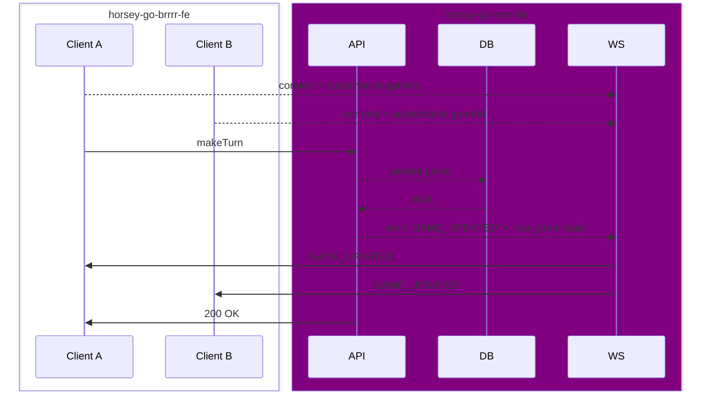

```mermaid
sequenceDiagram
	box horsey-go-brrrr-fe
	participant Client A
	participant Client B
	end

	box purple horsey-go-brrrr-be
	participant API
	participant DB
	participant WS
	end
	Client A -->> WS: connect + subscribe to gameId
	Client B -->> WS: connect + subscribe to gameId
	Client A ->> API: makeTurn
	API -->> DB: persist game
	DB -->> API: ACK
	API -->> WS: emit "GAME_UPDATED" + new game state
	WS ->> Client A: GAME_UPDATED
	WS ->> Client B: GAME_UPDATED
	API ->> Client A: 200 OK

```